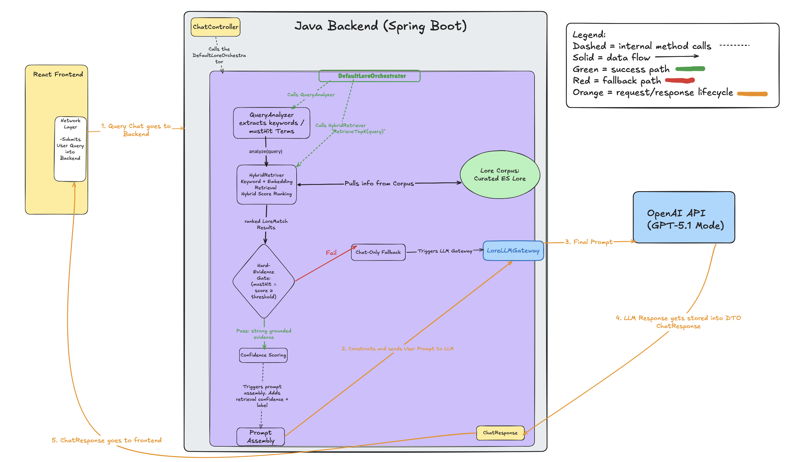

# 🏗️ Architecture

## Overview

ElderMind is an AI-powered Elder Scrolls lore assistant designed to provide grounded, canon-aware responses to user queries regarding the video game series.

Unlike traditional chatbots, ElderMind does not blindly rely on the language model. Instead, it uses a structured backend architecture to decide when to retrieve external lore evidence and when to fall back to a chat-only response.

The system is built as a layered Spring Boot backend that separates API handling, orchestration, retrieval logic, and LLM integration. This design makes the system easier to debug, safer against weak grounding, and more extensible for future improvements such as caching, monitoring, and database-backed retrieval.

## System Diagram

> This diagram illustrates the full request lifecycle, including hybrid retrieval, gating, confidence scoring, and fallback behavior.

View full-resolution diagram: [https://excalidraw.com/#json=fGg5dLdE5vBYq1YQQzYNS,NR3vLe9oJkQgmRis_6JKwQ]

## Component Breakdown

### React Frontend

The React frontend sends the user’s chat request to the backend.

The frontend is responsible for:

- collecting user input
- maintaining/displaying chat messages
- sending the current conversation context to the backend
- rendering the assistant response

The backend remains mostly stateless because the frontend sends the needed message history with each request.

---

### ChatController

`ChatController` is the API entry point for chat requests.

Its job is intentionally small:

- accept incoming chat requests
- forward the request to the lore orchestration layer
- return the final `ChatResponse`

The controller does not contain retrieval logic, prompt-building logic, or OpenAI-specific logic. This keeps the API layer thin and easy to maintain.

---

### DefaultLoreOrchestrator

`DefaultLoreOrchestrator` is the core decision-making layer of ElderMind.

It coordinates the full AI response flow:

- extracts the latest user query
- calls the query analyzer
- runs hybrid retrieval
- applies hard-evidence and threshold gates
- decides whether retrieval should be used
- computes retrieval confidence
- builds the grounded prompt
- routes the request through the LLM gateway
- logs retrieval decision metadata

This class acts as the “brain” of the system, but it does not directly perform every task itself. Instead, it delegates retrieval, prompt assembly, and LLM execution to specialized components.

---

### HybridRetriever

`HybridRetriever` retrieves and ranks relevant lore documents from the curated corpus.

It combines two retrieval signals:

- keyword-based matching
- embedding-based semantic similarity

The final ranking uses a blended score so the system can benefit from both exact matching and semantic understanding.

---

### QueryAnalyzer
`QueryAnalyzer` extracts meaningful terms from the user query.

Its main purpose is to identify “must-hit” terms that help determine whether retrieved evidence is actually relevant.

For example, generic terms like:

- `what`
- `tell`
- `history`
- `thing`

are filtered out, while lore-specific terms like:

- `Redoran`
- `Vivec`
- `CHIM`
- `Tribunal`

are preserved.

The output from this component helps power the hard-evidence gate.

---

### LLM Gateway
...